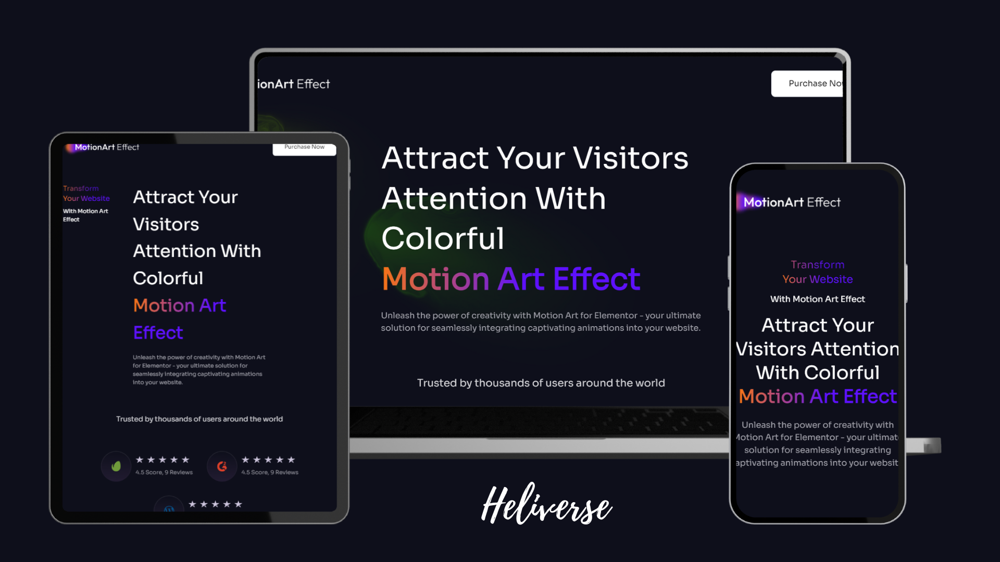

# Motion Art for Elementor

------

## Overview

Motion Art for Elementor is a React-based application that seamlessly integrates captivating animations into your website. This project leverages GSAP (GreenSock Animation Platform) for animations and ScrollTrigger for scroll-based animations, ensuring a smooth and visually appealing user experience.

## Features

- Lightweight and efficient design
- 100% responsive, providing a consistent visual experience across all devices
- User-friendly interface for both developers and end-users
- Seamless integration with Elementor
- Compatible with all major web browsers

## Technologies Used

- React.js: A JavaScript library for building user interfaces.
- Tailwind CSS: A utility-first CSS framework for creating custom designs with ease.

## Installation

To run this project locally, follow these steps:

1. Clone the repository: `https://github.com/satish-kumar75/Heliverse.git`
2. Navigate to the project directory: `cd Heliverse`
3. Install dependencies: `npm install`
4. Start the development server: `npm run dev`
5. Open your browser and visit `http://localhost:5173` to view the application.

